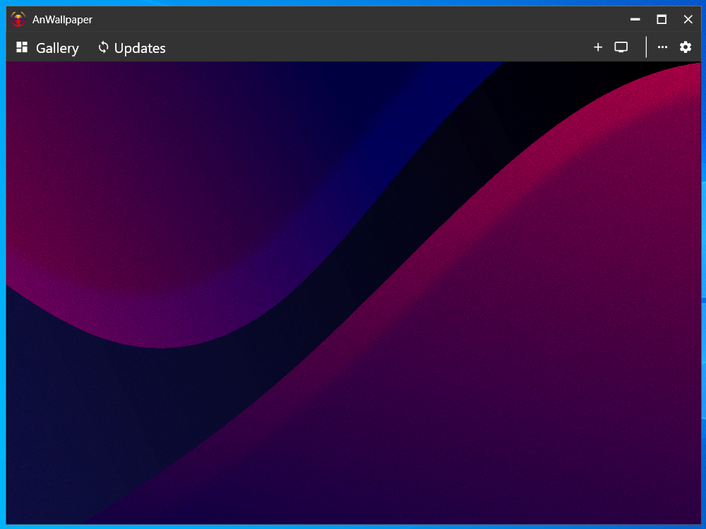

# 
GASHPID ENGINE

<h3>Welcome to my technological world!</h3>

  As an electronic engineer, I fuse my fascination for astronomy, neuroscience, hardware design, and software development to create innovative solutions. From circuit design to the implementation of advanced software, my goal is to create technologies that not only solve problems but also inspire and pave the way for new technological horizons. Explore with me projects where science and engineering meet creativity to propel the future. Join me on this exciting journey towards technological excellence!

 

## Some Projects I've Done

  

    

      
<h3>AnWallpaper</h3>

      <a href="https://github.com/AnWallpaper/AnWallpaper">
        

          
        

      </a>
      

        AnWallpaper is a Windows application programmed in C# that allows you to use videos as dynamic wallpapers. Transform your desktop with high-definition videos, providing a unique and attractive visual experience.
      

    

  

  

    

      
<h3>Mini Telescope (MTP)</h3>

      <a href="https://github.com/Gashpid/MTP">
        

          
        

      </a>
      

        Mini Telescope (MTP) is a hardware project based on the Raspberry Pi. This innovative telescope leverages image processing techniques to automatically guide and track celestial objects, making astronomy more accessible and enjoyable.
      

    

  

